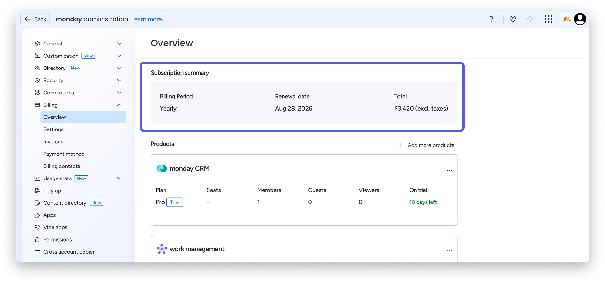
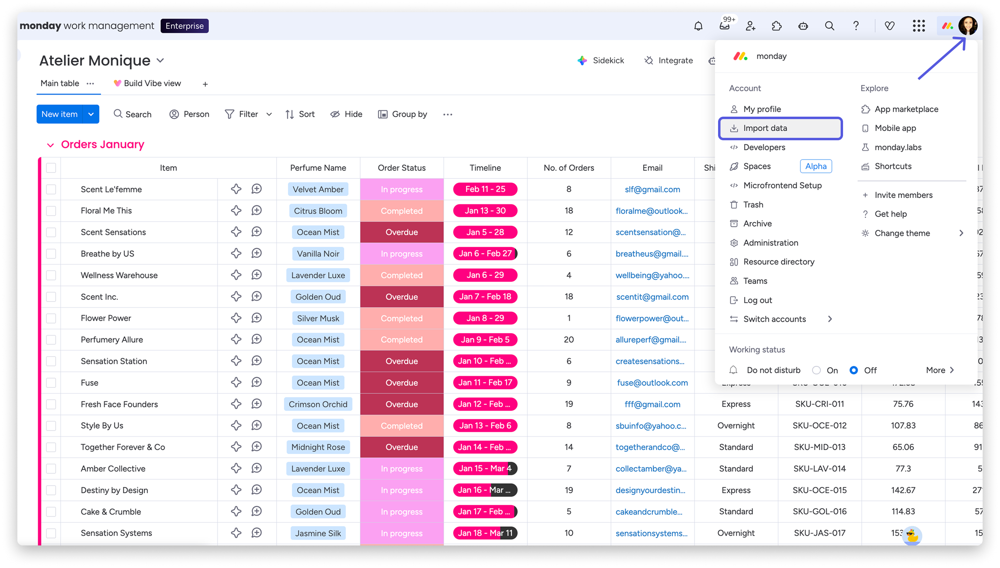
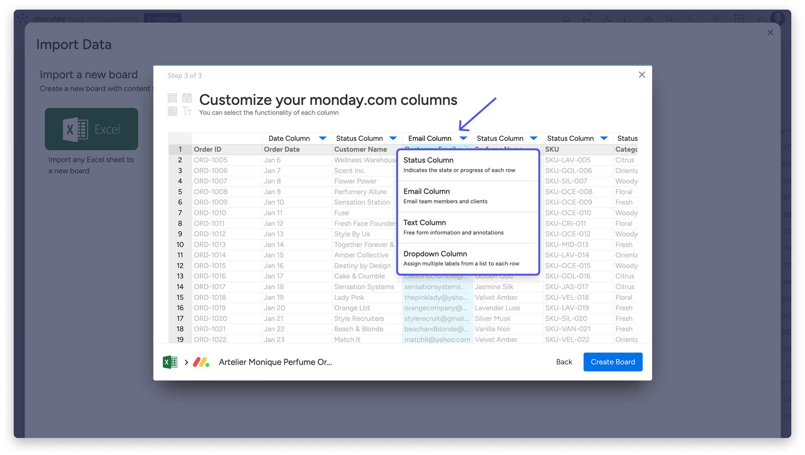
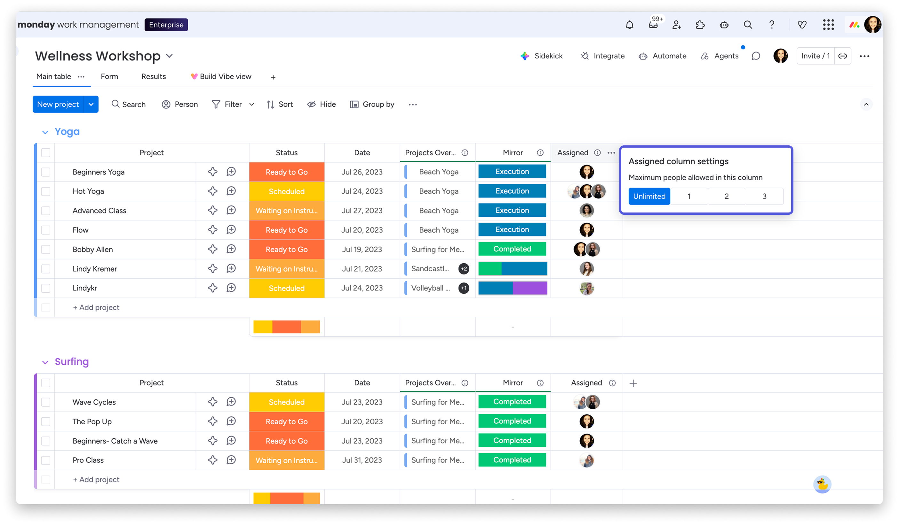
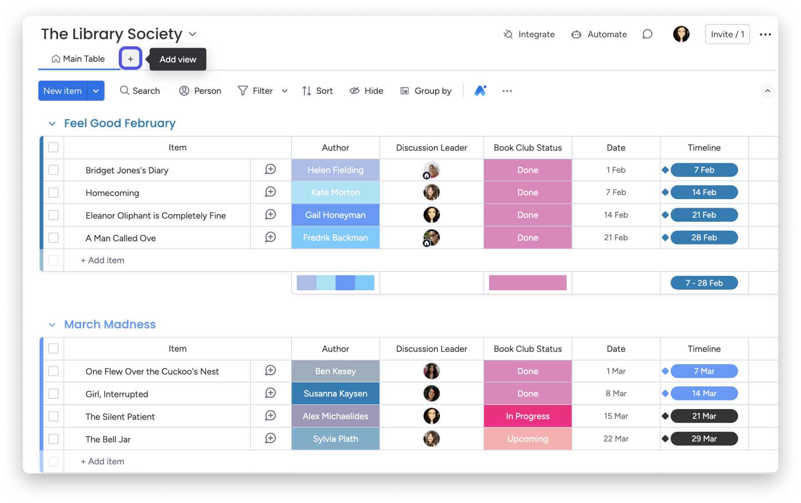
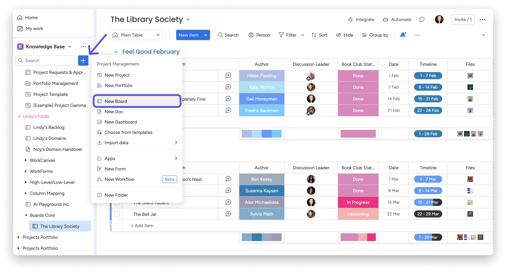
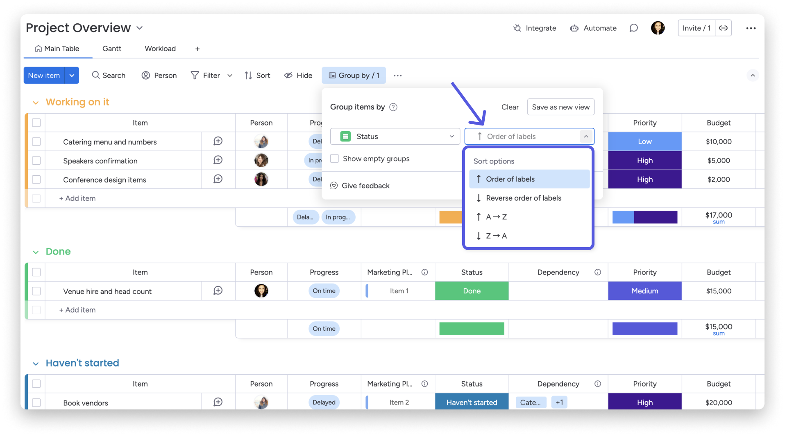
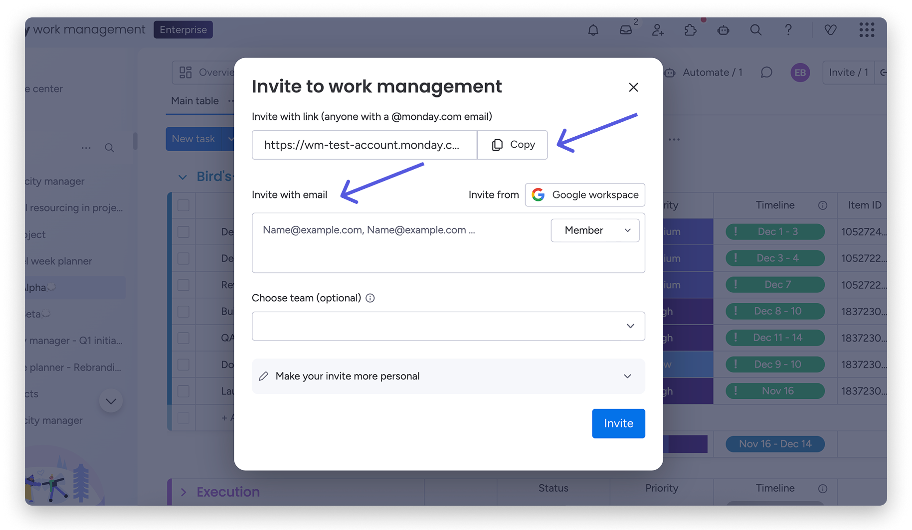
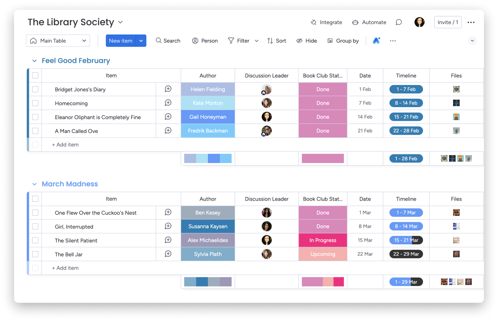

# PenniBlack Collective

# Day 1 monday.com manual

Monday 5 October 2026 | Prepared 2 October 2026

**Purpose:** follow Chapters 1-8 to establish the task board, agree current work, create the Venue Pipeline and prepare the first Tuesday review on 6 October.

Allow 7-8 hours. Start time remains to be agreed. This manual describes work to perform; no live board, invitation or integration is certified as complete.

## How to use this manual

Keep the client import pack open beside monday.com. Follow each chapter in order, complete its checks and record outstanding decisions in the handover record. Invite agreed current members early if needed for assignments; Chapter 7 verifies the final access position.

| Chapter | Work | Elapsed time |
|---|---|---|
| 1 | Access and client decisions | 0:00-0:30 |
| 2 | Task board, import and groups | 0:30-2:00 |
| 3 | Now tasks, owners and dates | 2:00-3:30 |
| 4 | Brand and priority views | 3:30-4:15 |
| 5 | Venue Pipeline | 4:15-5:15 |
| 6 | Tuesday review view | 5:15-6:00 |
| 7 | Current-team access | 6:00-6:45 |
| 8 | Walkthrough and handover | 6:45-7:30 |
| Allowance | Breaks, access delays and corrections | 7:30-8:00 |

### About the screens and current interface

The images are genuine, unaltered screenshots published by monday.com, retrieved on 2 October 2026. They contain the vendor's demonstration records, not client data. Their sample products, plan tiers, names and amounts are not instructions to copy. Written settings in this manual take precedence over sample values in the pictures.

The official product-updates page and current help articles were checked. Board basics was last modified 25 September 2026, board views 24 September, imports 15 September and billing 14 September. Some reference images are older than their articles. No signed-in client workspace or account-specific build number was available, so exact menu placement and feature availability must be checked in Chapter 1. This is a current-documentation check, not verification of the client's deployed version.

Use the PDF bookmarks to jump between chapters. Zoom in on screenshots when needed. Online sources and image provenance appear at the end.

<!-- page -->

## Before starting: client files and scope

**Repository:** use the repository root on the computer running the session. File paths below are relative to that root. Use the current main branch files.

| File | How to use it |
|---|---|
| day1/Monday_Main_Board_Import.csv | Recommended upload. One header row and 138 tasks. |
| day1/Monday_Day1_Import_Pack.xlsx | Main Board Import; Now Review (agree on the day); Venue Pipeline Import; Team Invites (confirm). |
| PenniBlack_Collective_Team_and_Tasks_FINAL_1.xlsx | Updated master. Task List has Due date in column K. Start Here links Owner and Done only. |
| day1/DAY1_RUNBOOK.md | Detailed reference and permanent live handover record. |
| docs/ROLLOUT_PLAN.md | Authoritative phase boundaries. |

### Pre-session checklist

- [ ] Agree the start time and availability of the business lead and workspace admin.
- [ ] Test remote screen sharing/control and opening the correct workspace.
- [ ] Confirm subscription and required account roles; these remain unverified.
- [ ] Confirm the updated master was distributed and is the version being used.
- [ ] If the master changed after preparation, reconcile and refresh the import before uploading.
- [ ] Collect missing individual emails and verify addresses already supplied.
- [ ] Have the import CSV and workbook available on the computer running the browser.

### What belongs in Day 1

Build the core task board, assign agreed current work, create the brand and Tuesday views, build the venue structure, establish current-team access and demonstrate the system.

Dashboard/reporting, dated availability and commercial targets are Day 2. Automations, reminders and the planned AI connection are Day 3. Review after one to two weeks and further integrations are Day 4 or later. Import all 138 source tasks, including future work, without treating them all as Day 1 implementation commitments.

The quote/invoice and staffing workbooks are references only today. Do not import their jobs, crew directory or rota tabs into the central task board. Their reporting gaps and import preparation remain later work.

**Completion rule:** tick a check only after observing the result. Record unavailable access, missing input or an unsuccessful test as outstanding with a responsible role and follow-up date.

<!-- page -->

## Chapter 1. Confirm access and client decisions

**Time:** 0:00-0:30. **Result:** correct workspace, working access and agreed structure.

### In monday.com

1. Sign in to the client's account and select the agreed workspace in the left sidebar. Record its name and URL in the handover record. Search the sidebar for the task board and Venue Pipeline before creating anything.
2. Ask the account admin to open **profile picture > Administration > Billing > Overview**. Check the actual work-management product, plan tier and seats. Confirm the planned Pro access; the picture below shows sample billing only. If a purchase is needed, the account owner resolves it separately.
3. Open **Administration > Directory > Users** to check existing users and roles. The Monday operator needs Admin access; the setup consultant needs Member access. Confirm actual board editing access too.
4. Agree who should access each board and whether a Main or Private board fits that audience. Do not assume that inviting only selected people restricts a Main board's visibility. Record the choice before importing client records.
5. Review the 12 groups in Chapter 2. Confirm any requested structure changes before moving tasks. For an existing board, inspect its Task ID column and current records first.
6. Check tasks 1-4 for completion without silently moving their 2 October deadlines. Confirm the responsible owner for task 80, the Pichi attendee-list follow-up due 5 October. Apply confirmed status changes after the baseline import reconciliation.

**Screen 1.** Look for Billing > Overview and the relevant product's plan and seats. Source: [Managing your billing](https://support.monday.com/hc/en-us/articles/360018098000-Managing-your-billing).

### Complete before proceeding

- [ ] Workspace, subscription, roles, board audience and structure are recorded.
- [ ] Early invitees have agreed roles and verified individual addresses.
- [ ] Access blockers have a responsible role and follow-up date. If access is unavailable, use the meeting worksheets for decisions and leave live setup outstanding.

<!-- page -->

## Chapter 2. Import and organise the task board

**Time:** 0:30-2:00. **Board name:** PenniBlack Collective - Tasks.

### 2A. Choose the correct import route

1. **New board:** open **profile picture > Import data > Excel**. The workspace **+ Add > Import data** route may also be available. Upload Monday_Main_Board_Import.csv. Do not upload the four-tab master.
2. Choose **Let's customize your new board**. Select **row 1** as the column titles, then **Next**. Select **Item (Task)** as the item-name column, then **Next**. Group is the first source column, so check the item-name selection explicitly.
3. Apply the import types on the next page, then select **Create Board**. Set the client board name, agreed workspace and visibility. Confirm the result before assigning work.
4. **Existing board:** open **New item arrow > Import items**, choose the CSV, map each field to the intended board column and choose the destination group under **Add items to**. Create missing final columns first. For a retry, choose **Skip**, matching on **Task ID**. Use Update only for a deliberate reviewed change; it can overwrite live assignments/statuses. If existing items lack source IDs, reconcile them before retrying.
5. If the CSV cannot be read correctly, use the pack's first sheet, **Main Board Import**, as the XLSX alternative. Import one version only. Confirm the success result and inspect the board before any retry.

**Screen 2.** The profile menu's Import data entry. Source: [Import files from Excel](https://support.monday.com/hc/en-us/articles/360000219209-Import-files-from-Excel).

<!-- page -->

### Chapter 2 continued: column mapping

**The following is the client-specific specification.** Preserve original timing and notes. Do not replace missing owner decisions with suggested names.

| Source field | New-board import type | Final board setting |
|---|---|---|
| Item (Task) | Item name | Task title |
| Group | Text | Original section; retain after moving groups |
| Workstream | Text | Text; use as supplied |
| Priority | Status | Preserve the three source labels below |
| Stage | Status | Now; Next; Later |
| Timing (as planned) | Text | Original timing, including provisional periods |
| Due date | Date | Actual deadline; blank stays unresolved |
| Owner | Text, blank | Change to People; confirm ownership model below |
| Suggested owner (confirm) | Text | Proposal only; never the People assignment |
| Status | Status | Not started; Working on it; Stuck; Done |
| Notes | Text | Change to Long Text; verify full text survived |
| Task ID | Number | Stable source ID 1-138; not auto-numbering |
| Rollout / review note | Text | Preserve exceptions and decision prompts |

Priority labels: **1 - Money before Christmas**, **2 - Build the brands**, **3 - Systems (2027)**.

<!-- page -->

### Chapter 2 continued: finish the column setup

6. After import, open a column header's **three-dot menu > Change column type** for Owner and Notes. If the needed conversion is unavailable, add the required column with the **+** at the right and verify values before retiring any duplicate column. Owner is blank at baseline.
7. For each Status-type column, click a cell > **Edit Labels**, enter/check that column's labels, then **Apply**. Configure Stage and Priority separately from task Status. Preserve all imported values; do not bulk-reset existing live work.
8. Confirm the ownership model with the client before setting a limit. Venue Sourcing includes shared work between the Monday operator and the incoming sales/events role. Agree whether each task can have one accountable owner, with collaborators recorded in Notes. If agreed, open **Owner header > three dots > Column Settings > Customize People column** and set the limit to **1** for Tuesday grouping. If joint ownership is required, retain multiple owners and use Chapter 6's per-owner filter route. Record the decision; never remove an existing assignee just to enable grouping.

**Screen 3.** Use the dropdown above each source field. The screenshot's example data and extra options are not the client mapping. Source: [Import guide](https://support.monday.com/hc/en-us/articles/360000219209-Import-files-from-Excel). Label editing: [Status column](https://support.monday.com/hc/en-us/articles/360001269685-The-Status-Column).

<!-- page -->

### Chapter 2 continued: groups and import checks

9. Use **New item arrow > New group of items** to create each agreed section. Click its heading to rename it. Retain the source labels below unless a change is explicitly agreed.
10. Filter the **Group** text column to one source section, select only its items using the row checkboxes, then choose **Move to > Move to group** in the batch menu. Select its matching group on this board. Repeat for every section, checking counts, then clear the filter.

| Source group label | Tasks |
|---|---:|
| 0. Monday & Claude Setup | 13 |
| 1. All Brands | 16 |
| 1b. BNC Exhibition (end Oct) | 13 |
| 1c. Venue Sourcing | 14 |
| 2. PenniBlack Catering & Events | 11 |
| 3. Free Spirit Wellness | 12 |
| 4. Pichi | 9 |
| 5. Raquel's Staffing & Bar | 7 |
| 6. VENN Productions | 4 |
| 7. Be-Zing (Kids + Youth) | 23 |
| 8. The Edit (PBC Edit) | 5 |
| 9. Systems & Admin | 11 |
| Total | 138 |

The group labels above reproduce source records. Creating physical groups is separate from using the Group by view control.

11. Before live decisions, confirm IDs **1-138**, each once; **Now 26 / Next 66 / Later 46**; **Priority 1: 92 / 2: 40 / 3: 6**. For a wholly new import, Owner is blank and Status is Not started. On an existing board, record valid live differences rather than overwriting them.
12. Compare IDs **1, 9, 43, 55, 80, 128 and 138** with the CSV, including complete notes and timing. Check the nine import dates: four on **2026-10-02**, five on **2026-10-05**. Task 9's operational date is blank; its original 5 October deadline remains documented. Do not infer a Day 2 date.
13. If counts or fields disagree, identify the affected IDs and mapping before proceeding. Do not import the whole file again as new items. Record the baseline check, then apply confirmed completion updates and subsequent decisions.

### Chapter 2 completion

- [ ] All 138 source IDs and all group counts reconcile; no unexplained duplicates or sample tasks.
- [ ] Task text, notes, timing, priority, stage and dates survive; Owner is a People column.
- [ ] Task 9 and task 128 remain Day 2; task 10 remains Day 3.

Sources: [Groups](https://support.monday.com/hc/en-us/articles/360011472320-The-basics-of-groups), [moving items](https://support.monday.com/hc/en-us/articles/360000274519-How-to-move-a-group-item-or-subitem).

<!-- page -->

## Chapter 3. Agree Now tasks, owners and dates

**Time:** 2:00-3:30. **Result:** an agreed immediate work list.

1. Open **Now Review (agree on the day)** in the import pack. In the task board, select **Filter > advanced filters** and set **Stage is Now**. Clear any Person filter so unassigned tasks remain visible.
2. Review each source Now ID: **1-9, 28, 30-33, 43-45, 48, 55, 57, 59, 68-70, 80 and 128**. Confirm whether it stays in Now. If not, agree Next or Later and click its Stage cell to apply that decision. Review proposed additions from other stages too.
3. Record **Keep in Now?**, **Confirmed owner** and **Agreed due date** in the worksheet. Preserve Source due date and Suggested owner as references. A suggestion is not an assignment.
4. In monday.com, click the item's **Owner** cell and select the confirmed account member. If the person cannot be selected or lacks access, complete the agreed invitation route in Chapter 7 and record the assignment as pending until resolved.
5. Click **Due date**, choose the agreed calendar date and verify the year. Click **Status** to apply verified progress. Do not move original deadlines merely because they are past.
6. Review task 9 (dashboard) and 128 (availability) against Day 2; task 10 (AI connection) against Day 3. Record later dates only when agreed. Task 80's 5 October delivery still needs an accountable owner.
7. For every unresolved Now decision, add a dated note in **Rollout / review note** with the responsible role, missing decision and follow-up date. Update the handover action list too.

**Screen 4.** The vendor example has Unlimited selected. Choose **1** only after the client agrees one accountable owner per task. Shared Venue Sourcing work still needs its collaborators recorded; joint ownership uses the alternative in Chapter 6. Source: [People column](https://support.monday.com/hc/en-us/articles/360002281539-The-People-Column).

- [ ] Each agreed Now item has an owner and due date, or a recorded unresolved action.
- [ ] New Now additions are included in the live filter. Start Here remains a static snapshot.
- [ ] Priority 1's 92 tasks have not been mistaken for the immediate work list.

<!-- page -->

## Chapter 4. Save brand and priority views

**Time:** 3:30-4:15. **Result:** Marketing / brands, Now and Priority 1 views.

1. Open the task board. Click the **+ below the board title**, beside the existing view tabs, and choose **Table**. If the header is collapsed, expand it or use the view-name dropdown. Name the new view **Marketing / brands**.
2. Use **Hide** to show the task title, Group, Workstream, Priority, Stage, Owner, Status and Due date. Keep Task ID accessible for troubleshooting. Hide reference columns only in the view; do not delete them.
3. Start with all agreed sections visible. To focus on a brand, use **Filter**, select **Group**, then the exact section label. Check that expected tasks appear. Clear this temporary filter before saving the general cross-brand view, or name a separate view for a deliberately restricted brand.
4. Add another Table view called **Now**. Choose **Filter > advanced filters**: **Stage is Now AND Status is not Done**. Select **Save to this view**. Do not add an Owner filter that removes unassigned work.
5. Add a Table view called **Priority 1**. Set **Priority is 1 - Money before Christmas AND Status is not Done**. Save the filter to that view.
6. Switch away from each view and return. Verify names, columns and filters. Refresh once to check the saved configuration persists. Record any differing menu labels encountered in this account.

**Screen 5.** The + beside Main Table adds a view; Filter and Hide are in the toolbar. Sources: [Board views](https://support.monday.com/hc/en-us/articles/360001267945-The-board-views), [Board filters](https://support.monday.com/hc/en-us/articles/360003624660-The-Board-Filters).

- [ ] Brand filtering returns the intended section without deleting or moving records.
- [ ] Now excludes Done and includes unassigned current work.
- [ ] Priority 1 excludes Done and remains distinct from Now.

<!-- page -->

## Chapter 5. Build the Venue Pipeline

**Time:** 4:15-5:15. **Board name:** PenniBlack Collective - Venue Pipeline.

1. Search the workspace for an existing pipeline. If none exists, choose **left sidebar + Add > New board** and use the manual/blank-board route. Set the client board name and agreed visibility. Avoid generating sample venues or AI-managed columns.
2. Rename the item-name heading to **Venue name**. Remove only newly created demonstration rows after confirming they are examples. Retain any real pre-existing records.
3. Add the columns on the next page using the **+ at the right of the columns**. Rename each heading to match. The empty Venue Pipeline Import tab is the field reference; it is not a file of real leads to upload.
4. For **Stage**, click a cell > **Edit Labels**. Confirm **Contacted > Meeting > Trial > On supplier list**. Agree separate treatment for uncontacted, declined and deferred venues; only add those labels once agreed. Do not label an uncontacted lead Contacted.
5. Click **Group by**, choose **Stage**, then **Save as new view** and name it **Pipeline by stage**. An empty board is acceptable when no actual venues have been supplied.
6. When a genuine venue is supplied, create it through **New item**, then enter verified details. Set its People owner, Next action and Next action date before treating it as an active lead.

**Screen 6.** New Board is in the workspace + menu. Use the client's Venue Pipeline name and fields, not the sample board content. Source: [Board basics](https://support.monday.com/hc/en-us/articles/115005317249-The-basics-of-a-board).

<!-- page -->

### Chapter 5 continued: venue fields and checks

| Field | monday.com type | Client use |
|---|---|---|
| Venue name | Item name | One real venue per item |
| Stage | Status | Agreed pipeline stage |
| Venue type | Text | Type/category when known |
| Capacity | Numbers | Confirmed capacity; blank if unknown |
| Current caterer | Text | Existing supplier information |
| Contact name | Text | Verified business contact |
| Contact email / phone | Text | Combined contact details, matching the template |
| How they pick suppliers | Long Text | Procurement/application process |
| Owner | People | One accountable member |
| Next action | Text | Specific follow-up action |
| Next action date | Date | Agreed follow-up date |
| Notes | Long Text | Source/context and outstanding research |

7. Review the stage definitions and fields with the business lead and workspace admin. Confirm who will research and add the first actual venues. Put that action on the task board or in the handover record.
8. Return to the main task board. Tasks **45-47** cover the target list, top 20 and supplier research; they remain research tasks. Task **55** covers pipeline setup: change its Status to Done only after the board is built and reviewed.
9. Record the pipeline link and the agreed stage labels in the handover. If there are real records, check that each active lead has an owner, next action and follow-up date. Record incomplete leads as unresolved.

### Chapter 5 completion

- [ ] Pipeline exists in the agreed workspace with the correct visibility and fields.
- [ ] Stages are agreed, including where uncontacted/declined/deferred venues belong.
- [ ] Pipeline by stage opens correctly. No vendor samples are represented as client venues.
- [ ] Real active leads have an owner, next action and date, or a recorded blocker.
- [ ] Task 55 is complete only after review; tasks 45-47 retain their actual research status.

**Client position:** zero real venue records were present in the prepared template. A completed empty structure does not mean venue sourcing or research has been completed.

Stage grouping: [Group your board by anything](https://support.monday.com/hc/en-us/articles/4452237638546-Group-your-board-by-anything).

<!-- page -->

## Chapter 6. Prepare the Tuesday review

**Time:** 5:15-6:00. **First review:** Tuesday 6 October 2026.

1. On the task board, add a Table view and name it **Tuesday review**. Use **Filter > advanced filters** for **Stage is Now AND Status is not Done**. Save the filter to the view.
2. Follow the ownership decision from Chapter 2. For one accountable owner, check **Owner > three dots > Column Settings > Customize People column > 1**, then select **Group by > Owner**. For joint ownership, keep multiple owners and use the **Person** filter to review each owner in turn, with the Stage/Status filters retained. Clear Person to review unassigned work; keep the saved all-Now view free of a Person filter. Record which route was agreed.
3. Show **Group, Priority, Status, Due date and Owner** alongside the task title. Click the toolbar **Sort > Add new sort**, select **Due date** and choose earliest dates first. Save the view's sort using the available Save control; if offered Save as new view, retain a single clearly named Tuesday review view.
4. Reopen the saved view and check the filter, grouping and sort. Discuss blank due dates explicitly; do not assume where empty dates sort. Avoid a date filter that hides overdue or undated Now tasks.
5. On a real item whose values have been recorded and whose temporary test is agreed, set Stage to Now and Status to Not started. Confirm it appears; change Status to Done and confirm it disappears; return to Main Table and restore the original values.
6. Verify an unassigned Now item is visible. If none remains, agree a temporary owner-clearing test and restore it immediately. Assignments may notify members, so perform tests with the operator present. Record results, not just that a view was created.

**Screen 7.** This example groups by Status; select **Owner** for Tuesday review. Sources: [Group by](https://support.monday.com/hc/en-us/articles/4452237638546-Group-your-board-by-anything), [sorting](https://support.monday.com/hc/en-us/articles/360001381699-How-to-sort-columns-and-items).

- [ ] Tuesday review persists after reopening; completed items leave and unassigned work remains.
- [ ] Original test values are restored; blank dates and unresolved owners are on the review agenda.
- [ ] Save the view link for handover. A Tuesday dashboard remains Day 2 work.

<!-- page -->

## Chapter 7. Complete current-team access

**Time:** 6:00-6:45. Use **Team Invites (confirm)** as the access decision record.

1. Check **profile picture > Administration > Directory > Users** with the admin. Search existing accounts before issuing new invitations. Verify the email, account role and current status.
2. For an agreed new member, click **Invite members** in the top bar, enter their verified individual email and select **Member** or **Viewer** as agreed, then **Invite**. Members doing task work need editing access; Viewer is read-only. Admin designation is handled by the existing account admin.
3. On each required board, open **Invite** and add the intended existing account members. Check that the board's audience and permissions match Chapter 1. Account membership and a board invitation are separate from a successful access test.
4. Ask current invitees to accept and open the task board. Verify they can perform the intended task action. Record **Decision, Verified email, Agreed role and Invite status** in the sheet. Distinguish existing active access, sent/pending, accepted, deferred and blocked.
5. If an invitation is missing, check the address and junk folder. The admin can find a Pending user and use their **three-dot menu > Resend invitation**. Record the outcome; do not mark a pending invite as accepted.

**Screen 8.** Use Invite with email and the role dropdown. The sample link/domain is not the client's. Source: [Inviting users](https://support.monday.com/hc/en-us/articles/360002430099-How-to-invite-users-to-join-an-account).

<!-- page -->

### Chapter 7 continued: client access decisions by source row

| Import-pack row | Role / timing | Day 1 action |
|---|---|---|
| 2, 3 | Founder; marketing lead / Monday operator | Check current access; operator needs Admin |
| 6, 7 | Quotes/client liaison; part-time client support | Confirm current access and missing individual emails |
| 10 | IT/database setup consultant | Confirm Member access |
| 4, 5 | Creative lead end October; sales/events mid-October | Defer unless early access is agreed |
| 8, 9 | Flexible systems/events; logistics | Confirm timing; logistics is viewer/later in source |
| 11, 12 | Design partners; Pichi operator | No invite planned unless decision changes |

There are 11 source entries and three populated source email fields, all still requiring verification. Use the source sheet to identify individuals; a shared sales address is not automatically a personal login.

- [ ] Current invite/access outcomes are recorded; missing emails and rejected access have follow-up actions.

<!-- page -->

## Chapter 8. Walk through, verify and hand over

**Time:** 6:45-7:30. **Result:** the client can maintain the live system.

1. Have the workspace admin open **PenniBlack Collective - Tasks** and locate an agreed task using its title or Task ID filter. Have them set Owner, Stage, Status and Due date to agreed real values.
2. Ask them to open **Marketing / brands**, filter a chosen section, then open **Now**, **Priority 1** and **Tuesday review**. Confirm the intended item appears in the appropriate views.
3. Open **PenniBlack Collective - Venue Pipeline** and demonstrate its columns and Pipeline by stage. Add a record only if a genuine venue is supplied. Otherwise demonstrate the field locations and explain the next research action.
4. Review the acceptance checklist on the next page with the business lead. Resolve remaining problems in the final 30-minute allowance or record them with a responsible role and agreed date.
5. Copy the browser address after opening each board/view into the handover record. Reopen the saved Tuesday link to check it reaches the intended view. Do not enable public sharing to create a link.
6. Confirm the workspace admin maintains the live board. The master and import files are preparation snapshots and do not synchronise. New Now work belongs in the live Stage filter, not the static Start Here list.

**Screen 9.** Use the toolbar and editable cells during the walkthrough. This is a demonstration board, not the completed client system. Source: [Board basics](https://support.monday.com/hc/en-us/articles/115005317249-The-basics-of-a-board).

### Capture Day 2 inputs only

Agree the next session separately. Record reporting preferences, first dated team availability, commercial targets, source of weekly figures and the role responsible for updates. Quote/invoice figures need their documented checks before reporting; historical staffing rotas do not establish remaining availability.

<!-- page -->

### Chapter 8 continued: acceptance and handover record

Complete this record during the session and copy the results into **day1/DAY1_RUNBOOK.md**. Blank entries mean unconfirmed, not complete.

| Acceptance check | Result / evidence |
|---|---|
| 138 unique source IDs and 12 group counts reconciled | ______________________________ |
| Task wording, notes, timing and dates preserved | ______________________________ |
| Agreed Now owners/dates complete or explicitly unresolved | ______________________________ |
| Tasks 9, 128 and 10 follow the agreed phases | ______________________________ |
| Marketing / brands, Now and Priority 1 saved and tested | ______________________________ |
| Tuesday owner grouping, Done exclusion and unassigned visibility tested | ______________________________ |
| Venue fields/stages reviewed; research status accurately recorded | ______________________________ |
| Current-team roles and invite/acceptance outcomes recorded | ______________________________ |
| Workspace admin demonstrated task changes and views | ______________________________ |
| Business lead reviewed setup; unresolved actions have owners/dates | ______________________________ |

<!-- page -->

### Chapter 8 continued: session record and open actions

| Handover field | Record during the session |
|---|---|
| Agreed start / finish time | ______________________________ |
| Account / workspace name and URL | ______________________________ |
| Main task board URL | ______________________________ |
| Venue Pipeline URL | ______________________________ |
| Tuesday review URL | ______________________________ |
| Board visibility and permissions agreed | ______________________________ |
| Confirmed venue stages | ______________________________ |
| Client review completed / date | ______________________________ |
| Live board maintenance role | ______________________________ |
| Day 2 session and required inputs | ______________________________ |

| Open decision / issue / affected Task ID | Responsible role | Agreed follow-up date |
|---|---|---|
| ______________________ | ______________ | ____________ |
| ______________________ | ______________ | ____________ |
| ______________________ | ______________ | ____________ |
| ______________________ | ______________ | ____________ |

**Day 1 sign-off:** complete only when the agreed live outcomes and checks above are satisfied. Otherwise record what was achieved and what remains. An empty, reviewed Venue Pipeline can satisfy structure setup; venue research is a separate task.

<!-- page -->

## Sources, screenshots and maintenance

Client settings come from the repository's rollout plan, runbook, master audit and verified Day 1 import pack. The 2 October readiness check confirmed all 1,794 CSV/XLSX data cells match, 138 unique tasks and unchanged source workbooks. That validation does not establish a successful live import.

### Official product guidance checked 2 October 2026

- [Product updates](https://monday.com/whats-new) - current public release information; not a client build identifier.
- [Board basics](https://support.monday.com/hc/en-us/articles/115005317249-The-basics-of-a-board) - boards and navigation.
- [Import files from Excel](https://support.monday.com/hc/en-us/articles/360000219209-Import-files-from-Excel) - new/existing board import and matching items.
- [Groups](https://support.monday.com/hc/en-us/articles/360011472320-The-basics-of-groups) and [moving items](https://support.monday.com/hc/en-us/articles/360000274519-How-to-move-a-group-item-or-subitem).
- [People column](https://support.monday.com/hc/en-us/articles/360002281539-The-People-Column) and [Status column](https://support.monday.com/hc/en-us/articles/360001269685-The-Status-Column).
- [Board views](https://support.monday.com/hc/en-us/articles/360001267945-The-board-views), [filters](https://support.monday.com/hc/en-us/articles/360003624660-The-Board-Filters), [Group by](https://support.monday.com/hc/en-us/articles/4452237638546-Group-your-board-by-anything) and [sorting](https://support.monday.com/hc/en-us/articles/360001381699-How-to-sort-columns-and-items).
- [Invitations](https://support.monday.com/hc/en-us/articles/360002430099-How-to-invite-users-to-join-an-account), [board permissions](https://support.monday.com/hc/en-us/articles/115005315809-Board-permissions) and [billing](https://support.monday.com/hc/en-us/articles/360018098000-Managing-your-billing).

### Image provenance

All images below are unchanged monday.com help-page assets. Copyright remains with their respective owner. Retain attribution when sharing the manual.

| Screen | Local image | Official attachment ID |
|---|---|---|
| 1 | billing-overview.png | 30545247037970 |
| 2 | import-menu.png | 34835902251538 |
| 3 | import-column-types.png | 34835902252946 |
| 4 | one-owner.png | 33589968897682 |
| 5 | add-view.png | 17750031885330 |
| 6 | create-board.png | 17768536967314 |
| 7 | group-by.png | 23738268483602 |
| 8 | invite-members.png | 31894061722898 |
| 9 | board-overview.png | 17768544723346 |

Original images resolve at https://support.monday.com/hc/article_attachments/ followed by the attachment ID. Captions link to the explanatory source articles. No screenshots were taken inside the client's signed-in workspace, and no account settings, boards or invitations were changed while preparing this manual.

If the live interface differs, use the official source link, verify the equivalent control with the workspace admin and record the difference. Update this manual after confirmed changes without altering the original client source records.
